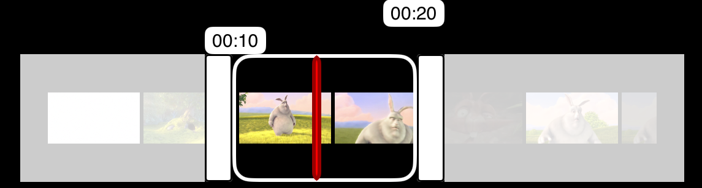
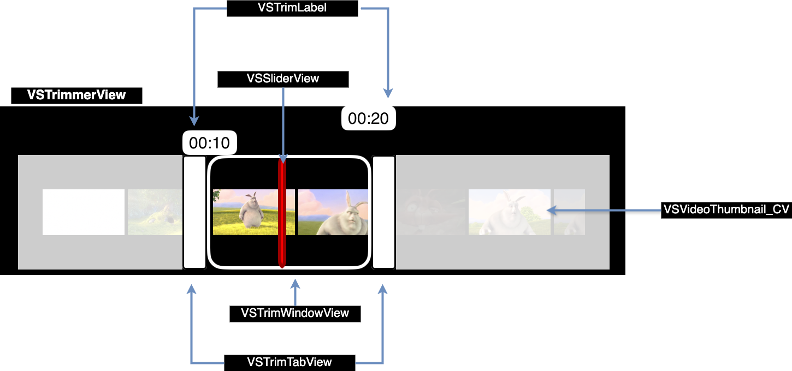
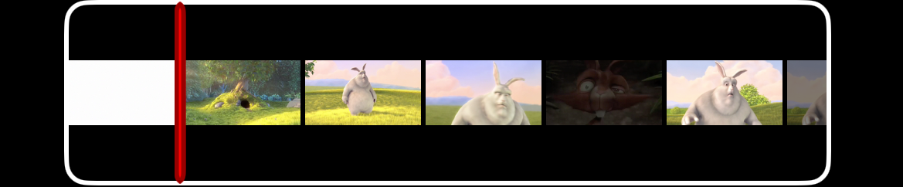

🎬 VSVideoScrubber



VSVideoScrubber is a customizable video scrubbing and trimming UI component for iOS. It allows users to preview and trim videos with a smooth experience, providing features like a thumbnail preview, trim controls, and customizable UI elements.

✨ Features
    •    🎥 Video Scrubbing: Navigate through videos with ease.
    •    ✂️ Video Trimming: Select start and end points for trimming.
    •    🎨 Highly Customizable UI: Customize colors, fonts, borders, and sizes.
    •    🖼 Thumbnail Previews: Displays video frames in a collection view.

                                                                                
🚀 Usage

1. Import the module

import VSVideoScrubber
                                                                                    
2. Configure and Setup VSVideoScrubber
                                                                                    

                                                                                    
- Configure UI properties for VSTrimLabel
```
        let trimLabelConfig = VSTrimLabelConfig(
            backgroundColor: .white,              // Background color of trim labels
            textColor: .black,                    // Text color
            textFont: UIFont(name: "Helvetica", size: 10)!, // Font type and size
            cornerRadius: 4,                      // Rounded corners
            viewHeight: 15,                        // Height of the trim label
            borderColor: .white,                   // Border color
            borderWidth: 1.0                       // Border width
        )
```
  
- Configuration for VSTrimTabView tabs (handles)
```
        let trimTabConfig = VSTrimTabViewConfig(
            backgroundColor: .white,  // Background color of the trim handle
            viewWidth: 15,            // Width of the trim handle
            borderColor: .black,      // Border color
            borderWidth: 1,           // Border width
            cornerRadius: 2           // Corner radius for rounded edges
        )
```

- Configuration for the VSSliderView indicator
```
        let sliderConfig = VSSliderViewConfig(
            color: .red,                                     // Color of the slider line
            cornerRadius: 5,                                 // Corner radius for rounded edges
            borderWidth: 2,                                  // Width of the border
            borderColor: .black.withAlphaComponent(0.4),     // Border color with transparency
            sliderWidth: 5                                   // Width of the slider indicator
        )
```
       
- Configuration for VSVideoThumbnail_CV
```
        let videoThumbnailConfig = VSVideoThumbnail_CVConfig(
            interItemSpacing: 2,                             // Space between thumbnails
            imageScaling: .scaleAspectFit,                   // Aspect fit scaling mode
            miniumCellWidth: 50                              // Minimum width of each thumbnail cell
        )
```

- Configuration for VSTrimWindowView
```
        let trimWindowViewConfig = VSTrimWindowViewConfig(
            normalBackgroundColor: .clear,                   // Default background color
            selectedBacgroundColor: .white.withAlphaComponent(0.4), // Background color when selected
            borderColor: .white,                             // Border color
            borderWidth: 2,                                  // Border width
            cornerRadius: 10                                 // Corner radius for rounded edges
        )
```
                                                                                    
-Main configuration object for the video scrubber
```
        let config = VSTrimmerViewConfig(
            maxTrimDuration: 15,                             // Maximum trimming duration allowed (seconds)
            minTrimDuration: 10,                             // Minimum trimming duration (seconds)
            startTrimTime: 10,                               // Initial start position for trimming
            endTrimTime: 20,                                 // Initial end position for trimming
            duration: 33,                                    // Total video duration
            spacerViewColor: .white.withAlphaComponent(0.8), // Spacer color for UI alignment
            trimTabConfig: trimTabConfig,                    // Assign the trim tab configuration
            trimLabelConfig: trimLabelConfig,                // Assign the trim label configuration
            trimWindowViewConfig: trimWindowViewConfig,      // Assign the trim window configuration
            sliderViewConfig: sliderConfig,                  // Assign the slider configuration
            trimMode: .Trim(hideTrimLabels: false, hasRestrictedSeek: true)
            // Modes
            // .Trim(hideTrimLabels:Bool,hasRestrictedSeek:Bool)
            //  - The trimming mode which allows users to trim a video.
            //    Parameters:
            //      - hideTrimLabels: A Boolean value that determines whether trim labels should be hidden.
            //      - hasRestrictedSeek: A Boolean value indicating whether seeking is restricted in this mode.

            // .SeekOnlyMode
            //- The seeking-only mode, where trimming is disabled, and users can only seek.
            
        )
```
- trimMode:.Trim(hideTrimLabels:Bool,hasRestrictedSeek:Bool)

                                                                                    
                                                                                    
- trimMode: .SeekOnlyMode

                                    
- Setup Scrubber
```
   videoScrubber = VSVideoScrubber(frame: .zero)
   videoScrubber.translatesAutoresizingMaskIntoConstraints = false
   self.view.addSubview(videoScrubber)
   //Adding Constraints
   NSLayoutConstraint.activate([
                   videoScrubber.topAnchor.constraint(equalTo: self.view.topAnchor),
                   videoScrubber.bottomAnchor.constraint(equalTo: self.view.bottomAnchor),
                   videoScrubber.leadingAnchor.constraint(equalTo: self.view.leadingAnchor),
                   videoScrubber.trailingAnchor.constraint(equalTo: self.view.trailingAnchor)
                                                                                            ])
        
        Task {
            ///
            /// - Parameters:
            ///   - player: The `AVPlayer` instance used for video playback.
            ///   - config: The configuration settings for the trimmer view.
            ///   - videoThumbnailConfig: The configuration settings for the video thumbnail collection view.
            ///   - videoScrubberDelegate: The delegate for handling video scrubber interactions.
            await videoScrubber.setupConfig(player: player,config:
                                                    config,videoThumbnailConfig:
                                                    videoThumbnailConfig, videoScrubberDelegate: self)

```
  
- VSVideoScrubberDelegate Methods
```
extension ViewController:VSVideoScrubberDelegate
{
    /// Called when the player's position changes during playback
    func playerPositionChanged(currentPosition: Double, duration: Double) {
        print("VSVideoScrubberDelegate : playerPositionChanged \(currentPosition) : \(duration)")
    }
    
    /// Called when the trim selection changes
    func trimPositionChanged(startTime: Double, endTime: Double) {
        print("VSVideoScrubberDelegate : trimPositionChanged \(startTime) : \(endTime)")
        
    }
}
```


                                                                                    
                                                                                
